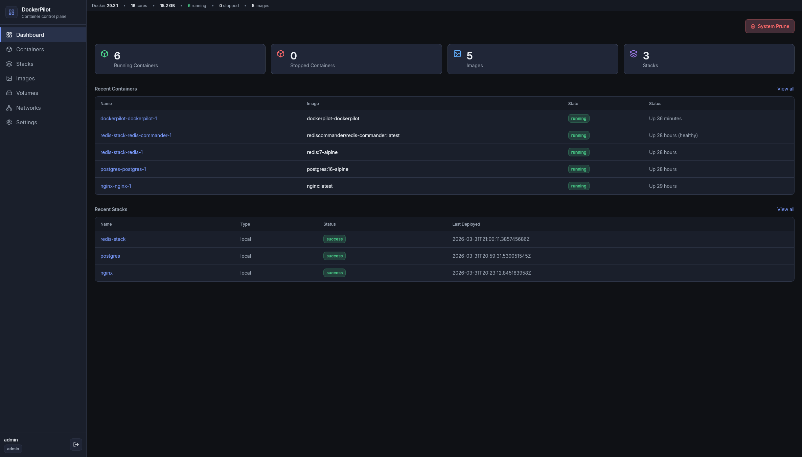

# DockerPilot

DockerPilot is a self-hosted Docker management dashboard built with Go, React, Vite, Tailwind, Zustand, and Docker Compose. It provides a single web UI for container, stack, image, volume, network, and system management, with real-time logs, live metrics, GitOps-oriented stack handling, and role-aware actions.

## What It Covers

- Real-time container management with start, stop, restart, and remove actions.
- Stack deployment and teardown with live deploy output.
- Image, volume, and network inspection and cleanup.
- Docker host visibility through live stats, container metrics, and logs.
- Authentication with local login and optional OIDC / SSO.
- Theme support with persisted dark and light modes.

## Architecture

DockerPilot uses a multi-stage Docker build that compiles the React frontend into static assets and the Go backend into a single runtime image. The runtime image includes the Docker CLI and Compose plugin so the app can operate against the host Docker socket from inside the container.

The frontend is structured around shared primitives rather than page-specific styling. The shell, tables, badges, dialogs, toast notifications, and form controls all consume the same semantic theme tokens so the UI stays consistent across dashboards, lists, forms, and detail views.

## Screenshots

Add screenshots to `docs/screenshots/` and replace the placeholders below with the actual files you want on GitHub.

| Area | Screenshot |
| --- | --- |
| Dashboard | `docs/screenshots/dashboard.png` |
| Containers | `docs/screenshots/containers.png` |
| Container Detail | `docs/screenshots/container-detail.png` |
| Stacks | `docs/screenshots/stacks.png` |
| Settings | `docs/screenshots/settings.png` |
| Login | `docs/screenshots/login.png` |

You can also embed the images directly in the README once they exist:

```md

```

## Quick Start

This is the fastest way to run DockerPilot locally or on a small server.

1. Install Docker and the Compose plugin.
2. Clone the repository.
3. Review `.env.example` and create a `.env` file if you want custom secrets or paths.
4. Start the app with the quick-start compose file:

```bash
docker compose -f docker-compose.quickstart.yml up -d --build
```

5. Open `http://localhost:8080`.

Useful follow-up commands:

```bash
docker compose -f docker-compose.quickstart.yml logs -f
docker compose -f docker-compose.quickstart.yml down
```

## Hosting

For a persistent host deployment, mount the Docker socket and keep the app data on a named volume. The quick-start compose file included in this repo uses the same runtime image and exposes the application on port `8080`.

Recommended host steps:

1. Set a strong `JWT_SECRET`.
2. Configure OIDC only if you want SSO.
3. Keep Docker socket access limited to the machine you trust.
4. Back up the `dockerpilot-data` volume if you need database persistence.
5. Point `STACKS_DIR` at the directory that contains your stack definitions.

## Configuration

The main environment variables are documented in `.env.example`.

- `PORT` controls the HTTP port.
- `JWT_SECRET` signs auth tokens.
- `DB_PATH` points to the SQLite database file.
- `OIDC_ISSUER`, `OIDC_CLIENT_ID`, `OIDC_CLIENT_SECRET`, and `OIDC_REDIRECT_URL` enable SSO.
- `REPO_BASE_PATH` is where GitOps repositories are stored.
- `WEBHOOK_SECRET` protects webhook-triggered stack updates.
- `STACKS_DIR` controls where local stack definitions are loaded from.
- `SCAN_INTERVAL` sets the stack scanner cadence.

## Development

Backend and frontend can be run independently during development:

```bash
make backend
make frontend
```

Build the production artifacts with:

```bash
make build
```

## Resume Bullet Points

Use these bullets if you want a concise architecture-focused resume entry:

- Designed a multi-stage Go + React deployment that ships a single Docker runtime image with Docker socket access for host-level container operations.
- Replaced hard-coded UI styling with a semantic token system and persisted dark/light theme state across the shell, tables, forms, and detail views.
- Built reusable shell, table, badge, dialog, toast, and form primitives to keep the UI consistent while reducing page-level duplication.
- Kept the existing operational flows intact while improving the frontend architecture for maintainability, deployment simplicity, and role-aware access control.

## Notes

- The project expects access to the host Docker socket.
- The compose file in this repo is intended for local or single-host deployment, not multi-tenant isolation.
- Screenshots should be optimized before publishing to GitHub.
